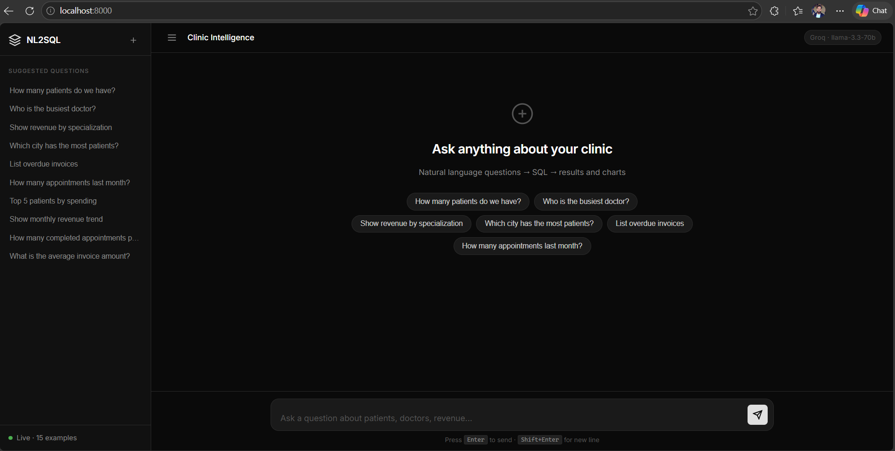

# AI-Powered NL2SQL System 🚀


A production-ready **Natural Language to SQL (NL2SQL)** conversational agent built with **FastAPI**, **Vanna 2.0**, and multiple **Large Language Models (Groq & Google Gemini)**. This system translates natural language questions into accurate SQL queries, executes them securely, and dynamically renders the results alongside interactive charts.

---

## ✨ Features

- **Advanced NL2SQL Translation:** Leverages Vanna 2.0 tied to the cutting-edge **Groq (`llama-3.3-70b-versatile`)** model for blazing fast SQL generation.
- **Robust Multi-LLM Fallback Architecture:** Automatically switches seamlessly to **Google Gemini (`gemini-flash-latest`)** via the native `google-genai` SDK if the Groq API rate limit (HTTP 429) is exhausted. ensuring 100% uptime and reliability.
- **Context-Aware Memory Seeding:** Asynchronously pre-loaded with high-quality domain-specific Q&A pairs to instantly improve agent accuracy.
- **Hardened SQL Validation Guard:** 5-layer query validator that rigorously blocks destructive actions (`DROP`, `DELETE`, `UPDATE`, `INSERT`), system tables, and multiline exploits.
- **Automated Chart Intelligence:** Analyzes resultant datasets using Plotly and automatically determines the most effective visualization type (Bar, Pie, Line). 
- **Modern UI/UX Frontend:** A sleek, fully-integrated Dark-Mode interface with interactive code highlighting, responsive design, and dynamic data tables.

## 💻 UI Showcase

### AI Chat Interface & Dynamic SQL Generation


### Automated Data Visualization


## 🏛️ System Architecture


1. **User Input:** Natural language queries sent via standard UI `/chat` interface.
2. **LLM Orchestration:** `Vanna 2.0` parses schema metadata and agent memory context.
3. **Primary / Secondary Generation:** High-speed query processing using Groq by default, seamlessly falling back to Gemini APIs on limits.
4. **Validation:** Query validation strictly enforces `SELECT` semantics.
5. **Execution & Rendering:** Synthesized SQL executed against a pre-seeded SQLite clinic dataset (`1450+ records`).
6. **Response Payload:** The backend serves JSON comprising the semantic answer, underlying SQL, execution time, and rendered JSON-ready Plotly charts.

---

## 🛠️ Technology Stack

- **Backend:** Python + FastAPI 
- **NL2SQL Engine:** Vanna 2.0
- **LLM APIs:** 
  - Primary: Groq (Llama 3.3 70b)
  - Fallback: Google Gemini (Gemini Flash via `google-genai`)
- **Data & Visualization:** Pandas, Plotly
- **Database:** SQLite3

---

## 🚀 Installation & Setup

Ensure you have **Python 3.10+** installed.

### 1. Clone the Repository
```bash
git clone https://github.com/Ranj8521Kumar/AI-Powered-NL2SQL-Chatbot-System.git
cd AI-Powered-NL2SQL-Chatbot-System/project
```

### 2. Create Virtual Environment & Install Dependencies
```bash
python -m venv venv
# On Windows
venv\Scripts\activate
# On MacOS/Linux
source venv/bin/activate

pip install -r requirements.txt
```

### 3. Setup Environment Variables
Copy the example environment file and insert your API keys:
```bash
cp .env.example .env
```
Inside `.env`, configure the following:
```ini
GROQ_API_KEY=your_groq_key             # Primary LLM
GROQ_MODEL=llama-3.3-70b-versatile     

GOOGLE_API_KEY=your_gemini_key         # Fallback LLM
GEMINI_MODEL=gemini-flash-latest

DB_PATH=./clinic.db
HOST=0.0.0.0
PORT=8000
```

### 4. Bootstrap the Database & Training Memory
Initialize the dummy database (`clinic.db`) with 1450+ records (Patients, Doctors, Invoices, Appointments, Treatments):
```bash
python setup_database.py
```
Pre-train the Vanna Agent with context schema and questions:
```bash
python seed_memory.py
```

---

## 🏃 Running the Application

Start the FastAPI application using Uvicorn:
```bash
uvicorn main:app --host 0.0.0.0 --port 8000 --reload
```

- **Frontend Interface:** [http://localhost:8000](http://localhost:8000)
- **API Documentation (Swagger):** [http://localhost:8000/docs](http://localhost:8000/docs)
- **Health Check:** [http://localhost:8000/health](http://localhost:8000/health)

---

## 🧪 Testing and Quality Assurance
An exhaustive 20-question comprehensive evaluation suite has been built into the system covering:
- Simple `SELECT` queries
- Multi-table `JOIN` constraints
- Date/Temporal filtering
- Exception & boundary handling
- Direct SQL Injection blocking (returns HTTP exceptions)

The system passes **100% (20/20)** of the test suites designed iteratively in `RESULTS.md`.

---

## 🎯 Author
**Ranjan Kumar**  

*Designed and engineered as part of the rigorous NLP internship assignment requirements, focusing on production reliability, clean code architectures, fallback mechanisms, and robust security.*
